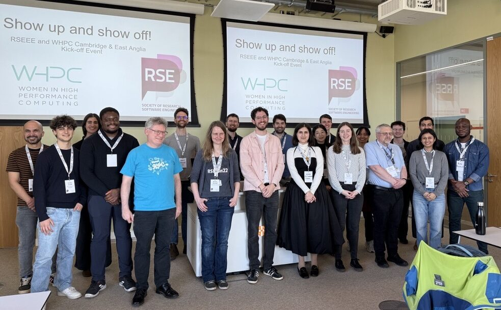

[Home](README.md) | [Charter](charter.md)

# Welcome

Welcome to Cambridge & East Anglia's WHPC Chapter!

<!--  -->

## Upcoming Events

We'll keep you posted...

## Past Events

### Thursday 27th March 2025 - RSEEE + WHPC Cambridge&East Anglia Kick-Off Event

On Thursday, March 27, after months of planning and organising, the day had finally come: the Women
in High Performance Computing (WHPC) chapter Cambridge and East Anglia, and the Research Software
Engineering in the East of England (RSEEE) regional group welcomed a group of about 25 Researchers,
Research Software Engineers, HPC Platforms Specialists and other Research Technical Professionals
from the region in Cambridge.

For more information, please see our [blog
post](https://east-england.society-rse.org/show-up-and-show-off-kick-off/).

## Mailing List

If you would like to stay up-to-date on Cambridge & East Anglia's WHPC Chapter, please join our mailing list.

To join, you can send a blank email to:

[whpc-cambridge-east-anglia-mailinglist+subscribe@googlegroups.com][subscribe]

**Note:** if you are signing up with a University of Cambridge Google account e.g., `cam.ac.uk` you need to opt into Google
Groups before you try to join. You should be able to opt-in via [this link][google-preferences]. You may need
to append `?authuser=<Google account email address>` to the URL if that doesn't work.

## Contact Us

If you would like to reach out to the organising committee of the WHPC Chapter, please email us at
[whpc-cambridge-east-anglia@googlegroups.com][email].

[subscribe]: mailto:whpc-cambridge-east-anglia-mailinglist+subscribe@googlegroups.com
[email]: mailto:whpc-cambridge-east-anglia@googlegroups.com
[google-preferences]: //preferences.g.apps.cam.ac.uk/
