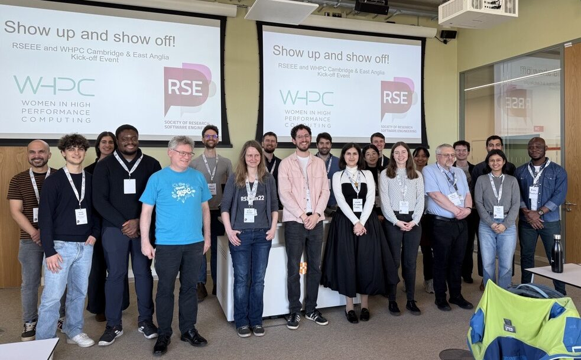
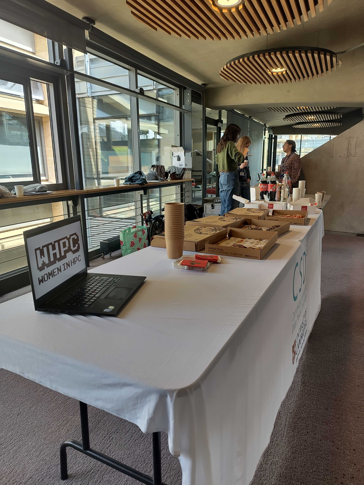
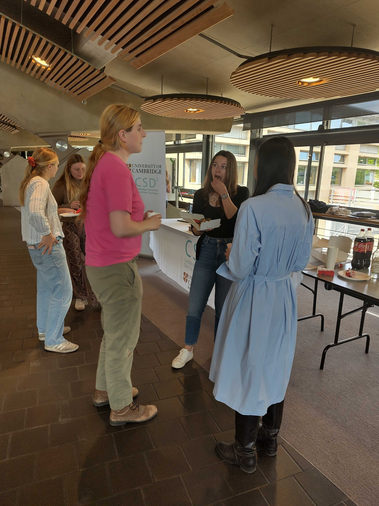
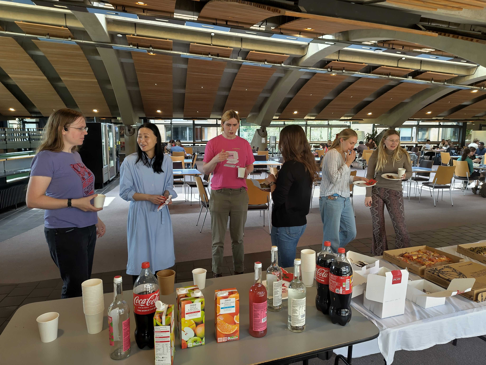

[Home](README.md) | [Charter](charter.md)

# Welcome

Welcome to Cambridge & East Anglia's WHPC Chapter!

## Upcoming Events

### Thursday, June 18 1pm - Durham HPC Days
WHPC Cambridge and East Anglia chapter will be participating in [Durham HPC Days](https://hpc-days.github.io/Durham-HPC-Days-2026)! Look out for committee members Tom Meltzer, Marion Weinzierl and Jack Franklin at the session ["We know what to do, so why aren't we doing it? Closing the EDI Implementation Gap with lessons from EuroHPC, UKRI and Beyond"](https://hpc-days.github.io/Durham-HPC-Days-2026/programme-days-2026/we-know-what-we-have-to-do-thursday-session-13-00/) on Thursday 1pm. Come and say "hi" if you're attending in person! Or register for free online attendance [here](https://hpc-days.github.io/Durham-HPC-Days-2026/online/).

## Past Events

### Thursday, May 21 2026 - Lunchtime Meetup

We hosted our inaugural WHPC Cambridge and East Anglia lunch on Thursday May 21, 2026 in the Centre for Mathematical Sciences. It was great to see our members in person enjoying the delicious lunch (and dessert!) generously provided by Research Computing Services, University of Cambridge. It was especially nice to see new faces! 

We hope to see many more of you at future events! 

### Wednesday, 22 April 2026 - RSEEE + WHPC Cambridge&East Anglia Annual Meetup Event

In partnership with [RSEEE](https://east-england.society-rse.org/) and NBI, we hosted an annual meet-up in Norwich.

For further details, see the [event webpage](https://rse-whpc.nbi.ac.uk/).

### Thursday 27th March 2025 - RSEEE + WHPC Cambridge&East Anglia Kick-Off Event

On Thursday, March 27, after months of planning and organising, the day had finally come: the Women
in High Performance Computing (WHPC) chapter Cambridge and East Anglia, and the Research Software
Engineering in the East of England (RSEEE) regional group welcomed a group of about 25 Researchers,
Research Software Engineers, HPC Platforms Specialists and other Research Technical Professionals
from the region in Cambridge.

For more information, please see our [blog
post](https://east-england.society-rse.org/show-up-and-show-off-kick-off/).

## Mailing List

If you would like to stay up-to-date on Cambridge & East Anglia's WHPC Chapter, please join our mailing list.

To join, you can send a blank email to:

[whpc-cambridge-east-anglia-mailinglist+subscribe@googlegroups.com][subscribe]

**Note:** if you are signing up with a University of Cambridge Google account e.g., `cam.ac.uk` you need to opt into Google
Groups before you try to join. You should be able to opt-in via [this link][google-preferences]. You may need
to append `?authuser=<Google account email address>` to the URL if that doesn't work.

## Contact Us

If you would like to reach out to the organising committee of the WHPC Chapter, please email us at
[whpc-cambridge-east-anglia@googlegroups.com][email].

[subscribe]: mailto:whpc-cambridge-east-anglia-mailinglist+subscribe@googlegroups.com
[email]: mailto:whpc-cambridge-east-anglia@googlegroups.com
[google-preferences]: //preferences.g.apps.cam.ac.uk/
